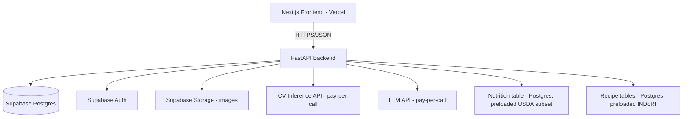

# DOCUMENT 2 — TECHNICAL REQUIREMENTS DOCUMENT (TRD)
## Food Rescue AI — Production Architecture (Cost-Effective, Fast-to-Ship)

---

## 1. System Overview

Food Rescue AI is a **modular monolith**, not a microservice architecture. One FastAPI backend serves all domains (ingredients, recipes, scoring, nutrition, AI integration) behind clear internal module boundaries, so it can be split into services later if scale demands it — but not before.

**Architecture principle driving every decision below: managed/serverless services + pay-per-call AI inference, to keep fixed costs near zero and let cost scale with actual usage.**

## 2. Technical Architecture (Stack Decision)

| Layer | Choice | Why (cost + speed rationale) |
|---|---|---|
| Frontend | Next.js (React) + Tailwind, deployed on **Vercel** | Free/cheap tier for low traffic, zero server management, fast to ship |
| Backend | **FastAPI** (Python), deployed on **Railway or Fly.io** (or AWS Lambda via Mangum for near-zero idle cost) | Single deploy target, pay-per-use on serverless option, no idle GPU/server cost |
| Database + Auth + Storage | **Supabase** (managed Postgres + Auth + Object Storage) | Replaces 3 separate services (RDS + Cognito + S3) with one managed, generous-free-tier product — directly serves "cost-effective" |
| Computer Vision inference | Pretrained/fine-tuned lightweight classifier (e.g., YOLOv8n or MobileNet-class model) hosted via a **pay-per-call inference API** (e.g., Replicate) rather than a self-hosted GPU server | Self-hosted GPU is the single biggest cost risk in this stack; pay-per-inference avoids idle cost entirely at low usage |
| LLM | A **fast, low-cost model tier**, called only for narrowly-scoped structured tasks (normalization, adaptation) with strict token limits and response caching | Minimizes per-call cost; abstracted behind an interface so provider/model can be swapped |
| Recipe data | INDoRI (primary, V1) — pre-processed once into Postgres at build time, not queried live from source | No runtime dependency on external dataset infra |
| Nutrition data | Curated subset of USDA FoodData Central, pre-loaded into Postgres for the supported ingredient list only | Avoids live USDA API cost/latency for every request |
| Caching | Postgres materialized results + in-process/Redis-optional cache for repeated ingredient-set → recipe queries | Redis is **optional** for V1 (add only if query volume justifies it) — avoid paying for a cache layer prematurely |
| Deployment | Vercel (frontend) + Railway/Fly.io or Lambda (backend) + Supabase (data) | No AWS account sprawl required for V1; AWS is a valid V2 migration target if scale demands, documented separately |

> **Explicit decision:** AWS full-stack (S3+RDS+Lambda+API Gateway+Cognito) is **not** the V1 choice. It's more powerful but higher setup overhead and non-trivial idle cost (RDS). Supabase collapses DB+Auth+Storage into one bill with a workable free tier, which directly satisfies "fast and cost-effective." AWS remains the documented V2 scale-up path (§41).

## 3. Architecture Diagram



## 4. Frontend Architecture

- Next.js App Router, TypeScript, Tailwind CSS.
- State: React Query (server state) + local component state; no global state library needed for V1 scope.
- API layer: single typed client module (`/lib/api.ts`) wrapping all backend calls.
- Image capture: browser `getUserMedia` / native `<input type=file capture>` for mobile camera.
- No SSR requirement for core flows beyond standard Next.js defaults (keeps hosting on Vercel's cheapest effective tier).

## 5. Backend Architecture

Modular monolith, one FastAPI app, organized by domain module:

```
/app
  /api          (route definitions per domain)
  /core         (config, security, db session)
  /models       (ORM models)
  /schemas      (Pydantic request/response models)
  /services
    /vision.py       (CV pipeline orchestration)
    /normalization.py (ingredient canonicalization + LLM calls)
    /retrieval.py     (recipe candidate retrieval)
    /feasibility.py   (Feasibility Engine)
    /rescue_score.py  (Rescue Scoring Engine)
    /nutrition.py     (nutrition lookup/aggregation)
    /adaptation.py    (LLM recipe adaptation + validation)
  /db           (migrations)
  /tests
```

- ORM: SQLAlchemy 2.0 + Alembic migrations.
- Async endpoints for I/O-bound calls (CV/LLM/DB).

## 6. API Architecture

REST/JSON, versioned under `/api/v1/`. No GraphQL (unjustified complexity for this data shape). No public API keys required for V1 (single-app consumer); JWT (Supabase Auth) for user-scoped endpoints.

## 7. Database Architecture

Single Postgres instance (Supabase). Normalized schema, no premature sharding/partitioning.

## 8. Database Schema

Only tables that are directly justified by a PRD feature are included.

### `ingredients`
Purpose: canonical ingredient list (the ~25–40 supported classes + broader named ingredients from INDoRI).
| Column | Type | Notes |
|---|---|---|
| id | uuid PK | |
| canonical_name | text unique | e.g. "tomato" |
| category | text | e.g. "vegetable" |
| is_cv_supported | boolean | whether detectable by vision model |
| created_at | timestamptz | |

### `ingredient_aliases`
Purpose: map raw/ambiguous names ("tomatoes", "tamatar") to canonical ingredient. Needed because CV output, user typing, and dataset text all vary.
| Column | Type | Notes |
|---|---|---|
| id | uuid PK | |
| ingredient_id | uuid FK → ingredients.id | |
| alias | text | indexed, unique per alias |

### `recipes`
Purpose: recipe metadata from INDoRI ingestion.
| Column | Type | Notes |
|---|---|---|
| id | uuid PK | |
| title | text | |
| source | text | "indori" (extensible for future sources) |
| cuisine | text | |
| cook_time_minutes | int | |
| servings | int | |
| instructions | text | |
| created_at | timestamptz | |
Index: `(cuisine)`, full-text index on `title`.

### `recipe_ingredients`
Purpose: normalized ingredient requirements per recipe — the core join table retrieval depends on.
| Column | Type | Notes |
|---|---|---|
| id | uuid PK | |
| recipe_id | uuid FK → recipes.id | |
| ingredient_id | uuid FK → ingredients.id | |
| quantity | numeric nullable | null = quantity unspecified in source |
| unit | text nullable | |
| is_required | boolean | false = optional/garnish-type ingredient |
Index: `(ingredient_id)` — this is the hot path for candidate retrieval.

### `nutrition_data`
Purpose: preloaded USDA subset for supported ingredients only.
| Column | Type | Notes |
|---|---|---|
| id | uuid PK | |
| ingredient_id | uuid FK → ingredients.id | |
| serving_size_g | numeric | |
| calories | numeric | |
| protein_g | numeric | |
| carbs_g | numeric | |
| fat_g | numeric | |
| fiber_g | numeric nullable | |
| source | text | "usda_fdc" |

### `users`
Purpose: managed by Supabase Auth; local table stores app-specific profile fields only.
| Column | Type | Notes |
|---|---|---|
| id | uuid PK (= supabase auth uid) | |
| display_name | text nullable | |
| created_at | timestamptz | |

### `rescue_sessions`
Purpose: one row per scan/entry session — needed for history, analytics, and re-scoring without re-detection.
| Column | Type | Notes |
|---|---|---|
| id | uuid PK | |
| user_id | uuid FK → users.id nullable | nullable = anonymous session allowed |
| created_at | timestamptz | |
| constraints_json | jsonb | time/servings/dietary/cuisine filters chosen |

### `inventory_items`
Purpose: ingredients (with quantity + Use First flag) attached to a session.
| Column | Type | Notes |
|---|---|---|
| id | uuid PK | |
| session_id | uuid FK → rescue_sessions.id | |
| ingredient_id | uuid FK → ingredients.id | |
| quantity | numeric nullable | |
| unit | text nullable | |
| use_first | boolean default false | |
| source | text | "detected" \| "manual" |
| detection_confidence | numeric nullable | only set if source = detected |

### `saved_recipes`
Purpose: user-saved recipes (Should Have feature, justified since Supabase Auth is already in stack for V1).
| Column | Type | Notes |
|---|---|---|
| id | uuid PK | |
| user_id | uuid FK → users.id | |
| recipe_id | uuid FK → recipes.id | |
| saved_at | timestamptz | |

**Tables explicitly excluded from V1** (no current feature justifies them): `food_items` (redundant with `ingredients`), `ingredient_detections` (folded into `inventory_items` via `source`/`detection_confidence` columns — avoids an unjustified extra table), `recipe_recommendations` (recommendations are computed on-demand, not persisted, in V1).

## 9. Entity Relationship Description

`users (1)—(N) rescue_sessions (1)—(N) inventory_items (N)—(1) ingredients`
`ingredients (1)—(N) ingredient_aliases`
`recipes (1)—(N) recipe_ingredients (N)—(1) ingredients`
`ingredients (1)—(1) nutrition_data`
`users (1)—(N) saved_recipes (N)—(1) recipes`

## 10. Computer Vision Pipeline

```
Image upload → validation (size/MIME) → OpenCV preprocess (resize, normalize, denoise)
  → pay-per-call inference API (pretrained/fine-tuned classifier, ~25-40 classes)
  → confidence-filtered predictions → map label → ingredient_id via ingredient_aliases
  → return list to client for confirmation
```

## 11. OpenCV Pipeline

OpenCV is used strictly for **preprocessing**, never classification:
- Decode + validate image.
- Resize to model's expected input dimensions.
- Color space conversion (BGR→RGB) as required by the inference model.
- Basic brightness/contrast normalization to reduce failure on poor lighting.
- Reject corrupt/unreadable files before sending to the inference API (saves a paid inference call on bad input — direct cost control).

## 12. Object Detection Pipeline

- Model: pretrained/lightly fine-tuned classifier covering ~25–40 common ingredient classes (exact model selection is an implementation choice made in Phase 6 — see Implementation Plan).
- Confidence threshold: predictions below 70% are shown but visually flagged "low confidence — please confirm."
- Detection is **presence-based**, not instance-counting, for V1 (counting multiples of the same item is out of scope — documented limitation, not silently wrong).

## 13. Ingredient Normalization

Two-stage:
1. Deterministic: exact/fuzzy match against `ingredient_aliases` (fast, free, no LLM call).
2. Fallback: if no match found, one LLM call returns a structured JSON best-guess canonical mapping, which is validated against the `ingredients` table before being accepted — if the LLM's suggestion doesn't exist in the table, the ingredient is surfaced to the user as "unrecognized, please select manually" rather than silently created.

LLM JSON schema for normalization:
```json
{
  "input_text": "tamatar",
  "best_match_canonical_name": "tomato",
  "confidence": "high"
}
```
Guardrail: `best_match_canonical_name` is looked up against `ingredients.canonical_name`; if no row matches, treat as unresolved.

## 14. Recipe Retrieval System

Pure SQL, no vector search, no embeddings (unjustified at this data scale and this directly serves the cost/speed mandate — one more paid service avoided):

```sql
SELECT r.id, r.title, r.cook_time_minutes,
       COUNT(*) FILTER (WHERE ri.ingredient_id = ANY(:user_ingredient_ids)) AS matched,
       COUNT(*) FILTER (WHERE ri.is_required) AS required_total
FROM recipes r
JOIN recipe_ingredients ri ON ri.recipe_id = r.id
GROUP BY r.id
HAVING COUNT(*) FILTER (WHERE ri.ingredient_id = ANY(:user_ingredient_ids)) > 0
ORDER BY matched DESC
LIMIT 50;
```
This candidate set (≤50) is then passed to the Feasibility Engine and Rescue Scoring Engine — never to the LLM in bulk.

## 15. Search Architecture

Ingredient search (manual entry autocomplete): Postgres `pg_trgm` trigram index on `ingredients.canonical_name` + `ingredient_aliases.alias`. No external search service needed at this scale.

## 16. Feasibility Engine

For each candidate recipe, compute:
- `required_missing`: required ingredients not in user inventory.
- `optional_missing`: optional ingredients not in inventory.
- `quantity_ok`: for each matched ingredient with both recipe-required and user quantity present, whether user quantity ≥ required quantity (unit-converted where units match; if units are incompatible/quantity unspecified on either side, mark `quantity_status = "unknown"`, never assumed true or false).

Outcome classification:
- **A. Fully feasible** — `required_missing = 0` and no `quantity_status = "insufficient"`.
- **B. Feasible with substitution** — exactly 1 required ingredient missing AND an LLM-validated substitute exists among user's inventory.
- **C. Feasible if 1–2 purchased** — `required_missing` in {1,2}, no substitute found.
- **D. Not recommended** — `required_missing` ≥ 3, or a core structural ingredient (e.g., the dish's defining ingredient) missing.

If the candidate set produces zero recipes in categories A–C, the system returns **"No reliable recipe found"** — it never forces a category-D recipe to the top of results.

## 17. Rescue Scoring Engine

**Rescue Score (0–100), computed only for recipes classified A, B, or C above.**

```
Rescue Score =
    Ingredient Coverage        (0-40)
  + Priority Ingredient Bonus  (0-15)
  + Quantity Feasibility       (0-25)
  + Time Compatibility         (0-10)
  + Recipe Feasibility Class   (0-10)
  - Missing Ingredient Penalty (0 to -20)
  - Extra Ingredient Penalty   (0 to -5)
```

| Component | Formula | Notes |
|---|---|---|
| Ingredient Coverage | `40 * (matched_ingredients / total_required_ingredients)` | Core signal |
| Priority Ingredient Bonus | `15 * (matched_use_first_ingredients / total_use_first_ingredients)` | 0 if user set no Use First items |
| Quantity Feasibility | `25` if all matched-with-quantity-data ingredients are sufficient; `15` if unknown/unspecified; `0` if any confirmed insufficient | Never rewards fabricated certainty |
| Time Compatibility | `10` if `cook_time_minutes ≤ user_max_time`; `5` if within 1.5x; else `0` | |
| Recipe Feasibility Class | Fully feasible = 10; Feasible w/ substitution = 7; Feasible if buy 1-2 = 4 | |
| Missing Ingredient Penalty | `-5 * required_missing` (capped at -20) | |
| Extra Ingredient Penalty | `-1 * unused_recipe_ingredients_beyond_2` (capped at -5) | Discourages recipes that barely use the user's items |

**Normalization:** final score clamped to [0, 100].
**Tie-breaking:** on equal score, prefer (1) fewer missing ingredients, then (2) shorter cook time.
**Missing data handling:** any component that cannot be computed due to missing data defaults to its most conservative (lowest non-penalizing) value — never assumed favorable.
**Range interpretation shown to user:** 85–100 "Great match," 60–84 "Good match," below 60 not shown as a top recommendation (still viewable under "Buy ingredients" if applicable).

This score is **fully deterministic** — no ML/LLM involved — so it is reproducible and auditable, directly answering the "how do you validate the score" judge question.

## 18. LLM Architecture

The LLM is invoked from exactly two backend service functions: `normalization.py` (fallback path only, §13) and `adaptation.py` (§below). It is never invoked from the retrieval or scoring path. All calls go through a single internal `llm_client` wrapper so the underlying model/provider can be swapped without touching business logic — protects the "cost-effective" goal if pricing changes.

## 19. LLM Prompting Strategy

- System prompt fixes output to strict JSON, temperature low (deterministic-leaning), max tokens capped per call type.
- Adaptation prompt receives: the recipe's ingredient list, the user's missing ingredients, and the canonical ingredient table subset (not the whole dataset) — so it can only suggest substitutions from real ingredients.

Adaptation JSON schema:
```json
{
  "missing_ingredient": "paneer",
  "suggested_substitute": "tofu",
  "substitute_is_in_user_inventory": true,
  "note": "Tofu can replace paneer in this stir-fry with similar texture."
}
```

## 20. LLM Guardrails

- Output must be valid JSON matching the schema or the call is retried once, then discarded (fall back to showing the recipe without a substitution suggestion — never block the flow).
- `suggested_substitute` is checked against `ingredients.canonical_name`; if not found, displayed as unverified with no substitution applied to the recipe's ingredient list.
- LLM is never asked for and never permitted to output nutrition values.
- Per-session LLM call cap (e.g., max 1 normalization call per unresolved ingredient, 1 adaptation call per recipe view) enforced server-side to bound cost.
- Adaptation/normalization results are cached by `(ingredient_set_hash, recipe_id)` so repeated identical requests don't re-call the LLM.

## 21. Nutrition Calculation

Computed by summing preloaded `nutrition_data` rows for matched ingredients scaled by recipe quantity ÷ serving size. If any ingredient in the recipe lacks a `nutrition_data` row, the response explicitly marks the total as **"partial estimate — N ingredient(s) missing nutrition data"** rather than silently omitting or guessing.

## 22. USDA Integration

One-time ETL (not a live runtime dependency): USDA FoodData Central data for the ~25–40 supported ingredients is downloaded once, cleaned, and loaded into `nutrition_data` via a seed script (`/scripts/seed_nutrition.py`). No live USDA API calls at request time — this is a direct cost/latency decision.

## 23. Dataset Processing Pipeline (INDoRI)

One-time ETL: download INDoRI → parse recipes/ingredients → resolve ingredient text to canonical IDs (building `ingredient_aliases` as needed) → load into `recipes`/`recipe_ingredients` via `/scripts/seed_recipes.py`. Re-run only when the dataset or canonicalization rules are updated — not on every deploy.

## 24. Data Cleaning

- Strip unit inconsistencies (normalize "gm"/"g"/"grams" → single unit code).
- Deduplicate near-identical ingredient names via alias table before insert.
- Drop recipes with no resolvable ingredients rather than inserting broken rows.

## 25. Data Normalization

All quantities stored in base units (grams for mass, ml for volume) with conversion at the edges (input/display), never mixed units inside scoring logic.

## 26. Data Storage

Postgres (Supabase) is the single source of truth for all structured data. Images stored transiently in Supabase Storage with a lifecycle rule to auto-delete after 24 hours (configurable) — controls both privacy exposure and storage cost.

## 27. Caching

V1: Postgres-level query result caching is unnecessary at expected V1 volume; application-level in-memory cache (per-process, short TTL) for repeated identical `(ingredient_set, constraints)` retrieval queries within a session. **Redis is explicitly deferred** until query volume data justifies its added cost/operational overhead.

## 28. API Request/Response Examples

**POST `/api/v1/detect`**
Request: multipart image upload.
Response:
```json
{
  "session_id": "uuid",
  "detections": [
    {"ingredient_id": "uuid", "label": "tomato", "confidence": 0.96},
    {"ingredient_id": "uuid", "label": "paneer", "confidence": 0.64}
  ]
}
```

**POST `/api/v1/recommendations`**
Request:
```json
{
  "session_id": "uuid",
  "constraints": {"max_time_minutes": 20, "servings": 2, "diet": "vegetarian"}
}
```
Response:
```json
{
  "cook_now": [
    {"recipe_id": "uuid", "title": "Paneer Fried Rice", "rescue_score": 94,
     "missing_ingredients": [], "cook_time_minutes": 15}
  ],
  "buy_one_or_two": [
    {"recipe_id": "uuid", "title": "Veg Pulao", "rescue_score": 78,
     "missing_ingredients": ["peas"], "cook_time_minutes": 25}
  ],
  "no_reliable_recipe": false
}
```

**GET `/api/v1/recipes/{id}/score-breakdown`**
Response:
```json
{
  "recipe_id": "uuid",
  "total": 94,
  "components": {
    "ingredient_coverage": 40,
    "priority_bonus": 15,
    "quantity_feasibility": 25,
    "time_compatibility": 10,
    "feasibility_class": 10,
    "missing_penalty": -5,
    "extra_penalty": -1
  }
}
```

## 29. Authentication Strategy

Supabase Auth (email/OTP or magic link — no custom auth server built). JWT issued by Supabase, verified in FastAPI via Supabase's public JWKS. Anonymous sessions allowed for the scan→recommend flow; auth required only to save recipes / view history.

## 30. Authorization

Row-level: a user can only read/modify their own `saved_recipes` and `rescue_sessions` (enforced both at the API layer and via Supabase Row Level Security policies as a second layer of defense).

## 31. Security

- Input validation via Pydantic schemas on every endpoint.
- Image upload: MIME allowlist (jpeg/png/webp only), max size 8MB, re-encoded via OpenCV (strips embedded payloads) before any further processing.
- Parameterized queries only (SQLAlchemy) — no raw string SQL.
- Secrets (LLM/CV API keys, DB credentials) via environment variables, never committed; managed through the hosting platform's secrets manager (Vercel/Railway/Supabase env vars).
- CORS restricted to the deployed frontend origin.
- LLM output is treated as untrusted input and validated (§20) — mitigates prompt-injection impact since output can't silently affect ingredient/nutrition truth data.

## 32. Rate Limiting

Simple per-IP/per-user token-bucket limiter at the API gateway level (e.g., 30 requests/minute) implemented via a lightweight FastAPI middleware — sufficient for V1 traffic, no dedicated rate-limiting service needed.

## 33. Logging

Structured JSON logs (request id, endpoint, latency, error) to stdout, captured by the hosting platform's built-in log viewer (Railway/Fly/Vercel) — no separate logging infrastructure for V1.

## 34. Monitoring

V1: platform-native uptime/error dashboards (Vercel/Railway built-ins) + a simple `/health` endpoint. Dedicated APM (e.g., Sentry) is a low-cost, high-value addition recommended even for V1 given its generous free tier — included as a Should Have.

## 35. Error Handling

Every service function returns a typed result (`Ok` / `Err(reason)`); API layer maps known error types to appropriate HTTP status + user-safe message. Unhandled exceptions return a generic 500 with a logged correlation ID, never a stack trace to the client.

## 36. File Upload Security

Covered in §31; additionally, uploaded files are streamed to Supabase Storage rather than held fully in backend memory beyond what OpenCV preprocessing requires.

## 37. Image Validation

Size, MIME, and successful-decode checks all happen **before** any paid inference call — this is both a security and a direct cost-control measure.

## 38. Model Inference

CV and LLM inference both happen via external pay-per-call APIs, isolated behind `vision_client` and `llm_client` wrapper modules respectively. No model weights are hosted/served by the application backend in V1 — this is the single largest cost-avoidance decision in the architecture.

## 39. Performance Requirements

| Operation | Target | Acceptable | Failure threshold |
|---|---|---|---|
| Image preprocessing (OpenCV) | <300ms | <800ms | >2s |
| CV inference (external call) | <2s | <4s | >8s (timeout, fallback to manual entry prompt) |
| Recipe retrieval (SQL) | <200ms | <500ms | >2s |
| Rescue scoring (per candidate set ≤50) | <150ms | <400ms | >1.5s |
| Nutrition calculation | <100ms | <300ms | >1s |
| LLM adaptation call | <3s | <6s | >10s (timeout, show recipe without adaptation) |

These are engineering targets to design against, not benchmarked guarantees — actual numbers depend on the chosen inference provider and must be validated in Phase 6/7.

## 40. Scalability

Vertical/managed scaling first: Supabase and serverless backend hosting both scale with usage without manual intervention up to moderate traffic. The candidate-set cap (≤50 recipes scored per request) keeps scoring cost flat regardless of catalog growth. No architectural rework needed until traffic significantly exceeds free/low-tier limits — at which point migration to dedicated Postgres + containerized backend (still not required to be AWS) is the natural next step.

## 41. Deployment Architecture

V1: Vercel (frontend) + Railway or Fly.io (backend) + Supabase (DB/Auth/Storage) + external CV/LLM pay-per-call APIs. No Kubernetes, no multi-region setup, no AWS account required for V1.

## 42. AWS Architecture (documented V2 migration path only — not built in V1)

If/when scale justifies it: API Gateway + Lambda (backend), RDS or Aurora Serverless (Postgres), S3 (image storage), Cognito (auth), CloudWatch (logging/monitoring). This is a **lift path**, not a V1 requirement — introducing it earlier would directly contradict the cost-effectiveness goal.

## 43. CI/CD

GitHub Actions: on push to `main` — run tests → run linter → deploy frontend to Vercel (native git integration) → deploy backend to Railway/Fly (native git integration) → run DB migrations (Alembic) as a deploy step.

## 44. Environment Variables

`DATABASE_URL`, `SUPABASE_URL`, `SUPABASE_SERVICE_KEY`, `SUPABASE_JWT_SECRET`, `CV_INFERENCE_API_KEY`, `LLM_API_KEY`, `IMAGE_MAX_SIZE_MB`, `LLM_CALL_CAP_PER_SESSION`, `ENVIRONMENT` (dev/staging/prod).

## 45. Testing Strategy

Unit tests (services, especially scoring/feasibility — pure functions, easy to test exhaustively), integration tests (API endpoints against a test DB), CV evaluation (precision/recall on a held-out labeled image set), LLM output-validity tests (schema conformance rate), load tests (locust/k6 against retrieval+scoring endpoints, the only ones with no external API dependency to bottleneck them).

## 46–51. Testing Detail

Covered together with concrete test cases in the Cross-Document Consistency file (Testing section) to avoid duplicating the same table twice.

## 52. Production Considerations

Backups: Supabase automated daily backups (built-in). Migrations: forward-only Alembic migrations, reviewed in PR. Rollback: redeploy previous Vercel/Railway build (both platforms support instant rollback natively).

## 53. Cost Considerations

| Cost driver | V1 approach | Why it's cost-effective |
|---|---|---|
| Compute (backend) | Serverless/low-tier PaaS, scales to ~0 at idle | No paid idle server |
| Database/Auth/Storage | Single Supabase project, free/low tier at V1 scale | One bill instead of three managed services |
| CV inference | Pay-per-call, no hosted GPU | Cost tracks actual usage, zero at idle |
| LLM | Cheap model tier, capped calls per session, response caching | Bounds worst-case per-user cost |
| Frontend hosting | Vercel free/hobby tier sufficient at V1 traffic | No cost until real scale |
| Nutrition/recipe data | One-time ETL, no live external API cost per request | Eliminates a recurring per-request cost entirely |
